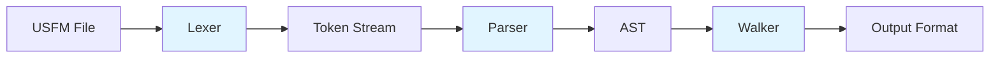

# Design Document: USFM Parser Refactor

## Overview

This design refactors the existing USFM-to-Accordance converter from a monolithic state-machine implementation into a clean three-stage compiler architecture: Lexer → Parser → Walker. The new architecture separates concerns, eliminates the nested marker handling bugs present in the current implementation, and creates reusable components for future USFM processing tools.

The system processes USFM (Unified Standard Format Markers) files containing Bible text with embedded markup tags. It tokenizes the input, builds an Abstract Syntax Tree (AST), and traverses the tree to generate output in various formats including Accordance import format (.acc) and simplified plain text for AI training.

Key architectural decisions:
- Zero runtime dependencies beyond Python standard library (click for CLI is acceptable)
- Explicit marker stack in parser to handle nested structures correctly
- Visitor pattern for walkers to support multiple output formats
- UTF-8-sig encoding handling to transparently manage BOM
- Line ending normalization to fix cross-platform issues

## Architecture

### Component Diagram



### Data Flow

1. **Lexer Stage**: Raw USFM text → Token stream
   - Input: String with USFM markers and text
   - Output: List of UsfmToken objects with type, value, and line number
   - Handles: Embedded markers (e.g., "word\w*"), unknown markers with warnings

2. **Parser Stage**: Token stream → AST
   - Input: List of UsfmToken objects
   - Output: Document node (root of AST)
   - Handles: Nested markers via explicit stack, glossary pipe delimiter extraction

3. **Walker Stage**: AST → Formatted output
   - Input: Document node
   - Output: String in target format
   - Handles: Format-specific rules (punctuation, spacing, filtering)

### Module Structure

```
usfmtools/
├── usfmlexer.py       # Tokenization: text → [UsfmToken, ...]
├── usfmparser.py      # Parsing: [UsfmToken, ...] → AST
├── usfmwalker.py      # Walking: AST → output string
├── usfmToAccordance.py  # CLI (~30 lines using above modules)
└── tests/
    └── test_usfm.py   # pytest unit and property tests
```

## Components and Interfaces

### Lexer Component (usfmlexer.py)

#### Token Types


```python
TOKEN_MARKER = "MARKER"          # Opening/standalone marker: \p, \v, \c, \s1
TOKEN_MARKER_END = "MARKER_END"  # Closing marker: \w*, \f*, \x*
TOKEN_TEXT = "TEXT"              # Plain text word or punctuation
```

#### UsfmToken Dataclass

```python
from dataclasses import dataclass

@dataclass
class UsfmToken:
    type: str      # TOKEN_MARKER, TOKEN_MARKER_END, or TOKEN_TEXT
    value: str     # Marker name (e.g., 'v', 'p') or text content
    line: int      # Source line number for error reporting
```

#### KNOWN_MARKERS Set

Single source of truth for supported USFM markers. Extensible by adding to this set:

```python
KNOWN_MARKERS = {
    # Identification
    'id', 'rem', 'h', 'toc1', 'toc2', 'toc3',
    # Titles
    'mt', 'mt1', 'mt2', 'mt3', 'ms', 'imt1', 'imt2',
    # Introductions
    'is', 'ip', 'ipr', 'imq', 'iot', 'io1', 'io2', 'io3', 'ior', 'ie', 'ili',
    # Headings
    's', 's1', 's2', 's3', 'r', 'mr', 'd', 'qa',
    # Chapter and Verse
    'c', 'v',
    # Paragraphs
    'p', 'm', 'mi', 'nb', 'b', 'pi', 'pi2', 'pmo',
    # Poetry
    'q', 'q1', 'q2', 'q3', 'q4', 'qc', 'qs',
    # Lists
    'li', 'li1', 'li2',
    # Footnotes
    'f', 'fr', 'fk', 'ft', 'fw', 'fp',
    # Cross-references
    'x', 'xo', 'xt',
    # Character styles
    'w', 'nd', 'add', 'qt', 'tl', 'rq', 'k',
    # Tables
    'tr', 'th1', 'th2', 'th3', 'tc1', 'tc2', 'tc3',
    # Special
    'periph', '+w',
}
```

End markers are recognized as any marker in KNOWN_MARKERS followed by `*` (e.g., `w*`, `f*`, `x*`).

#### Tokenize Function

```python
def tokenize(text: str, filename: str = '') -> list[UsfmToken]:
    """
    Tokenize USFM text into a stream of tokens.
    
    Args:
        text: Full USFM file content (BOM and CRLF already normalized)
        filename: Optional filename for error messages
        
    Returns:
        List of UsfmToken objects
        
    Behavior:
        - Splits on whitespace to get raw words
        - Scans each word for embedded \marker patterns using regex
        - Handles cases like "justify\w*" → [TEXT('justify'), MARKER_END('w')]
        - Handles cases like "\x*cule:" → [MARKER_END('x'), TEXT('cule:')]
        - Unknown markers emit TOKEN_MARKER with warning to stderr
        - Content is never silently lost
    """
```

**Implementation Strategy:**
1. Split text on whitespace to get raw words
2. For each raw word, use regex to find all `\marker` patterns
3. Split word into segments: text before marker, marker itself, text after marker
4. Classify each marker segment as MARKER or MARKER_END
5. Emit warning to stderr for unknown markers but still tokenize them
6. Track line numbers by counting newlines in original text

### Parser Component (usfmparser.py)

#### AST Node Classes

```python
from dataclasses import dataclass, field
from typing import List, Union

class UsfmNode:
    """Base class for all AST nodes"""
    pass

@dataclass
class Document(UsfmNode):
    """Root node containing all books"""
    books: List['Book'] = field(default_factory=list)

@dataclass
class Book(UsfmNode):
    """Represents a single Bible book"""
    book_id: str          # Three-letter code: 'MAT', 'GEN', etc.
    children: List[UsfmNode] = field(default_factory=list)  # Headers, chapters

@dataclass
class Chapter(UsfmNode):
    """Represents a chapter within a book"""
    number: str
    children: List[UsfmNode] = field(default_factory=list)  # Paragraphs, verses, headings

@dataclass
class Verse(UsfmNode):
    """Represents a verse within a chapter"""
    number: str
    children: List[UsfmNode] = field(default_factory=list)  # Inline content

@dataclass
class Paragraph(UsfmNode):
    """Paragraph marker (p, m, q1, pi, etc.)"""
    marker: str           # 'p', 'm', 'q1', 'pi', etc.
    children: List[UsfmNode] = field(default_factory=list)

@dataclass
class Heading(UsfmNode):
    """Section heading or title"""
    marker: str           # 's1', 's2', 'h', 'mt1', etc.
    text: str

@dataclass
class Footnote(UsfmNode):
    """Footnote content (usually discarded by walkers)"""
    children: List[UsfmNode] = field(default_factory=list)  # fr, ft, fk content

@dataclass
class CrossRef(UsfmNode):
    """Cross-reference content (usually discarded by walkers)"""
    children: List[UsfmNode] = field(default_factory=list)  # xo, xt content

@dataclass
class GlossaryWord(UsfmNode):
    """Word with glossary/lexical information"""
    word: str             # Text before | (or full text if no |)
    # Note: lemma form (after |) is discarded at parse time

@dataclass
class InlineSpan(UsfmNode):
    """Inline character style (add, nd, qt, tl, rq, etc.)"""
    marker: str
    children: List[UsfmNode] = field(default_factory=list)

@dataclass
class Text(UsfmNode):
    """Plain text content"""
    value: str

@dataclass
class Unknown(UsfmNode):
    """Unknown marker - content preserved with warning"""
    marker: str
    children: List[UsfmNode] = field(default_factory=list)
```

#### UsfmParser Class

```python
class UsfmParser:
    """
    Parses USFM token streams into Abstract Syntax Trees.
    """
    
    def __init__(self, debug: bool = False):
        """
        Initialize parser.
        
        Args:
            debug: Enable debug output to stderr
        """
        self.debug = debug
    
    def load(self, filename: str) -> Document:
        """
        Load and parse a USFM file.
        
        Args:
            filename: Path to USFM file
            
        Returns:
            Document node (root of AST)
            
        Behavior:
            - Opens with encoding='utf-8-sig' to strip BOM
            - Normalizes \r\n → \n
            - Calls loads() with file content
        """
        with open(filename, 'r', encoding='utf-8-sig') as f:
            text = f.read()
        # Normalize line endings
        text = text.replace('\r\n', '\n')
        return self.loads(text, filename)
    
    def loads(self, text: str, filename: str = '') -> Document:
        """
        Parse USFM text into an AST.
        
        Args:
            text: USFM content as string
            filename: Optional filename for error messages
            
        Returns:
            Document node (root of AST)
        """
```

**Implementation Strategy:**
1. Tokenize input text using lexer
2. Initialize token cursor and marker stack
3. Use recursive descent parsing:
   - Parse document → books
   - Parse book → chapters and headers
   - Parse chapter → verses and paragraphs
   - Parse verse → inline content
4. Track open markers on stack to handle nesting correctly
5. When encountering `\w` marker with `|` in content:
   - Extract text before `|` as word
   - Discard text after `|` (lemma form)
6. Raise descriptive exceptions for structural errors (missing chapter/verse numbers)

**Marker Stack Example:**
```
Input: \w word|lemma\w*
Stack operations:
  1. Push 'w' onto stack
  2. Collect content until \w*
  3. Split content on '|', take first part
  4. Pop 'w' from stack
  5. Create GlossaryWord node
```

### Walker Component (usfmwalker.py)

#### Base Walker Class

```python
class UsfmWalker:
    """
    Base class for AST traversal and output generation.
    Uses visitor pattern to dispatch to node-specific methods.
    """
    
    def render(self, node: UsfmNode) -> str:
        """
        Render an AST node to string output.
        
        Args:
            node: AST node to render
            
        Returns:
            String representation in target format
        """
        method_name = f'visit_{node.__class__.__name__.lower()}'
        method = getattr(self, method_name, self.visit_unknown_node)
        return method(node)
    
    def visit_document(self, node: Document) -> str:
        """Render document node"""
        return ''.join(self.render(book) for book in node.books)
    
    def visit_book(self, node: Book) -> str:
        """Render book node"""
        return ''.join(self.render(child) for child in node.children)
    
    def visit_chapter(self, node: Chapter) -> str:
        """Render chapter node"""
        return ''.join(self.render(child) for child in node.children)
    
    def visit_verse(self, node: Verse) -> str:
        """Render verse node"""
        return ''.join(self.render(child) for child in node.children)
    
    def visit_paragraph(self, node: Paragraph) -> str:
        """Render paragraph node"""
        return ''.join(self.render(child) for child in node.children)
    
    def visit_heading(self, node: Heading) -> str:
        """Render heading node - default: discard"""
        return ''
    
    def visit_footnote(self, node: Footnote) -> str:
        """Render footnote node - default: discard"""
        return ''
    
    def visit_crossref(self, node: CrossRef) -> str:
        """Render cross-reference node - default: discard"""
        return ''
    
    def visit_glossaryword(self, node: GlossaryWord) -> str:
        """Render glossary word - default: emit word only"""
        return node.word
    
    def visit_inlinespan(self, node: InlineSpan) -> str:
        """Render inline span - default: emit children"""
        return ''.join(self.render(child) for child in node.children)
    
    def visit_text(self, node: Text) -> str:
        """Render text node"""
        return node.value
    
    def visit_unknown_node(self, node: UsfmNode) -> str:
        """Render unknown node - warn and emit children if present"""
        import sys
        print(f"Warning: Unknown node type {node.__class__.__name__}", file=sys.stderr)
        if hasattr(node, 'children'):
            return ''.join(self.render(child) for child in node.children)
        return ''
```

#### AccordanceWalker Class

```python
class AccordanceWalker(UsfmWalker):
    """
    Walker that generates Accordance-compatible .acc format.
    """
    
    # Books to skip (glossaries, front matter, etc.)
    SKIPPED_BOOKS = {
        'GLO', 'XXA', 'XXB', 'FRT', 'XXC', 'XXD', 'INT', 'BAK',
        'XXE', 'XXF', 'XXG', 'CNC', 'TDX', 'OTH', 'TOB', 'JDT',
        'ESG', 'WIS', 'SIR', 'BAR', '1MA', '2MA', '1ES', 'MAN',
        'PS2', '3MA', '2ES', '4MA', 'DAG'
    }
    
    # Canonical book name mapping
    BOOK_NAMES = {
        "GEN": "Gen.", "EXO": "Ex.", "LEV": "Lev.", "NUM": "Num.",
        "DEU": "Deut.", "JOS": "Josh.", "JDG": "Judg.", "RUT": "Ruth",
        "1SA": "1Sam.", "2SA": "2Sam.", "1KI": "1Kings", "2KI": "2Kings",
        "1CH": "1Chr.", "2CH": "2Chr.", "EZR": "Ezra", "NEH": "Neh.",
        "EST": "Esth.", "JOB": "Job", "PSA": "Psa.", "PRO": "Prov.",
        "ECC": "Eccl.", "SNG": "Song", "ISA": "Is.", "JER": "Jer.",
        "LAM": "Lam.", "EZK": "Ezek.", "DAN": "Dan.", "HOS": "Hos.",
        "JOL": "Joel", "AMO": "Amos", "OBA": "Obad.", "JON": "Jonah",
        "MIC": "Mic.", "NAM": "Nah.", "HAB": "Hab.", "ZEP": "Zeph.",
        "HAG": "Hag.", "ZEC": "Zech.", "MAL": "Mal.", "MAT": "Matt.",
        "MRK": "Mark", "LUK": "Luke", "JHN": "John", "ACT": "Acts",
        "ROM": "Rom.", "1CO": "1Cor.", "2CO": "2Cor.", "GAL": "Gal.",
        "EPH": "Eph.", "PHP": "Phil.", "COL": "Col.", "1TH": "1Th.",
        "2TH": "2Th.", "1TI": "1Tim.", "2TI": "2Tim.", "TIT": "Titus",
        "PHM": "Philem.", "HEB": "Heb.", "JAS": "James", "1PE": "1Pet.",
        "2PE": "2Pet.", "1JN": "1John", "2JN": "2John", "3JN": "3John",
        "JUD": "Jude", "REV": "Rev."
    }
    
    def __init__(self, para: bool = True, tc: bool = True):
        """
        Initialize Accordance walker.
        
        Args:
            para: Include paragraph markers (¶) in output
            tc: Include text-critical marks (⸂ and ⸃) in output
        """
        self.para = para
        self.tc = tc
        self.first_verse = True
        self.pending_paragraph = False
        self.current_book = None
        self.current_chapter = None
    
    def visit_book(self, node: Book) -> str:
        """Render book - skip if in SKIPPED_BOOKS"""
        if node.book_id in self.SKIPPED_BOOKS:
            return ''
        self.current_book = self.BOOK_NAMES.get(node.book_id, node.book_id)
        return ''.join(self.render(child) for child in node.children)
    
    def visit_chapter(self, node: Chapter) -> str:
        """Render chapter - track chapter number"""
        self.current_chapter = node.number
        return ''.join(self.render(child) for child in node.children)
    
    def visit_verse(self, node: Verse) -> str:
        """Render verse with reference prefix"""
        # Format: "Book Chapter:Verse text..."
        # First verse has no leading newline
        prefix = '' if self.first_verse else '\n'
        self.first_verse = False
        
        reference = f"{self.current_book} {self.current_chapter}:{node.number}"
        
        # Add paragraph marker if pending and para flag is True
        para_marker = ' ¶' if (self.pending_paragraph and self.para) else ''
        self.pending_paragraph = False
        
        content = ''.join(self.render(child) for child in node.children)
        return f"{prefix}{reference}{para_marker}{content}"
    
    def visit_paragraph(self, node: Paragraph) -> str:
        """Mark that next verse should have paragraph marker"""
        self.pending_paragraph = True
        return ''.join(self.render(child) for child in node.children)
    
    def visit_text(self, node: Text) -> str:
        """Render text with punctuation spacing rules"""
        text = node.value
        
        # Suppress text-critical marks if tc=False
        if not self.tc and text in ('⸂', '⸃'):
            return ''
        
        # No space before punctuation
        if text and text[0] in '.,:;!?':
            return text
        
        return ' ' + text
    
    def visit_glossaryword(self, node: GlossaryWord) -> str:
        """Render glossary word with leading space"""
        # Add space before word (unless it starts with punctuation)
        if node.word and node.word[0] in '.,:;!?':
            return node.word
        return ' ' + node.word
```

#### SimplifyWalker Class

```python
class SimplifyWalker(UsfmWalker):
    """
    Walker that generates plain text output for AI training.
    Similar to AccordanceWalker but without reference prefixes.
    """
    
    def __init__(self):
        """Initialize simplify walker"""
        self.first_verse = True
    
    def visit_verse(self, node: Verse) -> str:
        """Render verse content without reference"""
        prefix = '' if self.first_verse else ' '
        self.first_verse = False
        content = ''.join(self.render(child) for child in node.children)
        return f"{prefix}{content}"
    
    def visit_text(self, node: Text) -> str:
        """Render text with punctuation spacing rules"""
        text = node.value
        if text and text[0] in '.,:;!?':
            return text
        return ' ' + text
```

#### ParagraphExtractWalker Class

```python
class ParagraphExtractWalker(UsfmWalker):
    """
    Walker that extracts paragraph marker locations.
    Returns dict mapping "BOOK CHAPTER:VERSE" → True for verses with \p.
    """
    
    def __init__(self):
        """Initialize paragraph extract walker"""
        self.paragraph_map = {}
        self.current_book = None
        self.current_chapter = None
        self.pending_paragraph = False
    
    def extract(self, node: Document) -> dict:
        """
        Extract paragraph locations from document.
        
        Returns:
            Dict mapping verse references to True
        """
        self.render(node)
        return self.paragraph_map
    
    def visit_book(self, node: Book) -> str:
        """Track current book"""
        self.current_book = node.book_id
        return super().visit_book(node)
    
    def visit_chapter(self, node: Chapter) -> str:
        """Track current chapter"""
        self.current_chapter = node.number
        return super().visit_chapter(node)
    
    def visit_paragraph(self, node: Paragraph) -> str:
        """Mark pending paragraph"""
        self.pending_paragraph = True
        return super().visit_paragraph(node)
    
    def visit_verse(self, node: Verse) -> str:
        """Record verse if paragraph is pending"""
        if self.pending_paragraph:
            ref = f"{self.current_book} {self.current_chapter}:{node.number}"
            self.paragraph_map[ref] = True
            self.pending_paragraph = False
        return super().visit_verse(node)
```

#### ParagraphApplyWalker Class

```python
class ParagraphApplyWalker:
    """
    Walker that inserts paragraph markers at specified verse locations.
    Modifies AST in place.
    """
    
    def __init__(self, paragraph_map: dict):
        """
        Initialize paragraph apply walker.
        
        Args:
            paragraph_map: Dict mapping verse references to True
        """
        self.paragraph_map = paragraph_map
        self.current_book = None
        self.current_chapter = None
    
    def apply(self, document: Document) -> Document:
        """
        Apply paragraph markers to document AST.
        
        Args:
            document: Document node to modify
            
        Returns:
            Modified document node
        """
        # Implementation would traverse AST and insert Paragraph nodes
        # before verses that appear in paragraph_map
        pass
```

## Data Models

### Token Model

```python
@dataclass
class UsfmToken:
    type: str      # "MARKER", "MARKER_END", or "TEXT"
    value: str     # Marker name or text content
    line: int      # Line number in source file
```

### AST Node Hierarchy

```
UsfmNode (base)
├── Document
│   └── books: List[Book]
├── Book
│   ├── book_id: str
│   └── children: List[Chapter | Heading]
├── Chapter
│   ├── number: str
│   └── children: List[Verse | Paragraph | Heading]
├── Verse
│   ├── number: str
│   └── children: List[Text | GlossaryWord | InlineSpan | Footnote | CrossRef]
├── Paragraph
│   ├── marker: str
│   └── children: List[UsfmNode]
├── Heading
│   ├── marker: str
│   └── text: str
├── Footnote
│   └── children: List[UsfmNode]
├── CrossRef
│   └── children: List[UsfmNode]
├── GlossaryWord
│   └── word: str
├── InlineSpan
│   ├── marker: str
│   └── children: List[UsfmNode]
├── Text
│   └── value: str
└── Unknown
    ├── marker: str
    └── children: List[UsfmNode]
```


## Correctness Properties

*A property is a characteristic or behavior that should hold true across all valid executions of a system—essentially, a formal statement about what the system should do. Properties serve as the bridge between human-readable specifications and machine-verifiable correctness guarantees.*

### Property 1: Tokenization Completeness

*For any* USFM text input, tokenizing SHALL produce a sequence of tokens where each token has a valid type (TOKEN_MARKER, TOKEN_MARKER_END, or TOKEN_TEXT) and the concatenation of all token values preserves the original content (excluding whitespace).

**Validates: Requirements 1.1, 1.3, 10.4**

### Property 2: Embedded Marker Splitting

*For any* word containing embedded USFM markers (e.g., "text\marker" or "text\marker*"), tokenizing SHALL produce separate tokens for the text portions and marker portions in the correct sequence.

**Validates: Requirements 1.4**

### Property 3: Line Number Accuracy

*For any* multi-line USFM text, each token SHALL have a line number that correctly identifies its position in the source text.

**Validates: Requirements 1.5**

### Property 4: AST Node Type Validity

*For any* valid USFM token sequence, parsing SHALL produce an AST where every node is an instance of a defined node type (Document, Book, Chapter, Verse, Paragraph, Heading, Footnote, CrossRef, GlossaryWord, InlineSpan, Text, or Unknown).

**Validates: Requirements 2.1**

### Property 5: Glossary Pipe Delimiter Handling

*For any* glossary word with a pipe delimiter (e.g., "\w word|lemma\w*"), parsing SHALL create a GlossaryWord node containing only the text before the pipe, discarding the lemma form after the pipe.

**Validates: Requirements 2.3**

### Property 6: Accordance Verse Format

*For any* verse node in the AST, rendering with AccordanceWalker SHALL produce output matching the pattern "BookName Chapter:Verse" followed by the verse content.

**Validates: Requirements 4.1**

### Property 7: Paragraph Marker Conditional Rendering

*For any* verse preceded by a paragraph marker, rendering with AccordanceWalker when para=True SHALL include " ¶" after the verse reference, and rendering when para=False SHALL omit the paragraph marker.

**Validates: Requirements 4.2**

### Property 8: Text-Critical Mark Suppression

*For any* text containing text-critical marks (⸂ or ⸃), rendering with AccordanceWalker when tc=False SHALL omit these marks from the output, and rendering when tc=True SHALL include them.

**Validates: Requirements 4.3**

### Property 9: Footnote and Cross-Reference Filtering

*For any* AST containing Footnote or CrossRef nodes, rendering with AccordanceWalker SHALL produce output that does not contain any content from those nodes.

**Validates: Requirements 4.4**

### Property 10: Glossary Word Rendering

*For any* GlossaryWord node, rendering with AccordanceWalker SHALL emit only the word portion (the text before the pipe delimiter if one was present in the source).

**Validates: Requirements 4.5**

### Property 11: Skipped Book Filtering

*For any* book with a book_id in the set {GLO, XXA, XXB, FRT, XXC, XXD, INT, BAK, XXE, XXF, XXG, CNC, TDX, OTH, TOB, JDT, ESG, WIS, SIR, BAR, 1MA, 2MA, 1ES, MAN, PS2, 3MA, 2ES, 4MA, DAG}, rendering with AccordanceWalker SHALL produce empty output for that book.

**Validates: Requirements 4.6**

### Property 12: Punctuation Spacing

*For any* text node whose value starts with a punctuation character (. , ; : ! ?), rendering with AccordanceWalker SHALL emit the text without a preceding space.

**Validates: Requirements 4.7**

### Property 13: BOM Handling

*For any* file containing a UTF-8 BOM (byte order mark), loading with Parser.load() SHALL successfully parse the file and the BOM SHALL not appear in the resulting AST text content.

**Validates: Requirements 6.1**

### Property 14: Line Ending Normalization

*For any* file containing Windows-style line endings (\r\n), loading with Parser.load() SHALL normalize them to Unix-style (\n) before parsing.

**Validates: Requirements 6.2**

### Property 15: Unicode Preservation

*For any* USFM text containing Unicode characters, parsing and rendering SHALL preserve all Unicode characters without corruption or loss.

**Validates: Requirements 6.3**

### Property 16: Error Message Context

*For any* parsing error, the exception message SHALL include both the filename (if provided) and the line number where the error occurred.

**Validates: Requirements 10.1**

### Property 17: Unknown Marker Warning and Continuation

*For any* USFM text containing markers not in KNOWN_MARKERS, tokenizing SHALL emit a warning to stderr and continue processing, producing tokens for the unknown markers.

**Validates: Requirements 10.2**

### Property 18: Structural Error Detection

*For any* USFM text missing required structural elements (chapter number after \c, or verse number after \v), parsing SHALL raise an exception with a descriptive message.

**Validates: Requirements 10.3**

### Property 19: Round-Trip AST Preservation

*For any* valid USFM document, parsing to AST, rendering back to USFM format, and parsing again SHALL produce an AST structurally equivalent to the original AST.

**Validates: Requirements 11.2**

### Property 20: Marker Recognition Completeness

*For any* USFM text containing markers from the supported set (id, rem, h, toc1, toc2, toc3, mt, mt1, mt2, mt3, ms, imt1, imt2, is, ip, ipr, imq, iot, io1, io2, io3, ior, ie, ili, s, s1, s2, s3, r, mr, d, qa, c, v, p, m, mi, nb, b, pi, pi2, pmo, q, q1, q2, q3, q4, qc, qs, li, li1, li2, f, fr, fk, ft, fw, fp, x, xo, xt, w, nd, add, qt, tl, rq, k, tr, th1, th2, th3, tc1, tc2, tc3, periph, +w), tokenizing SHALL recognize all markers and produce TOKEN_MARKER or TOKEN_MARKER_END tokens appropriately.

**Validates: Requirements 12.1, 12.2, 12.3, 12.4, 12.5, 12.6, 12.7, 12.8, 12.9, 12.10, 12.11, 12.12, 12.13**

## Error Handling

### Lexer Error Handling

1. **Unknown Markers**: When encountering a marker not in KNOWN_MARKERS:
   - Emit warning to stderr: "Warning: Unknown marker '\marker' at line N"
   - Create TOKEN_MARKER with the unknown marker name
   - Continue processing (never silently drop content)

2. **Malformed Markers**: When encountering backslash not followed by valid marker characters:
   - Treat as TEXT token
   - Continue processing

### Parser Error Handling

1. **Missing Chapter Number**: When \c marker is not followed by a number:
   - Raise exception: "Missing chapter number in {filename}:{lineno}"
   - Include filename and line number in error message

2. **Missing Verse Number**: When \v marker is not followed by a number:
   - Raise exception: "Missing verse number in {filename}:{lineno}"
   - Include filename and line number in error message

3. **Unmatched End Markers**: When encountering end marker without corresponding start marker:
   - Emit warning to stderr
   - Create Unknown node
   - Continue processing

4. **Unclosed Markers**: When reaching end of input with open markers on stack:
   - Emit warning to stderr
   - Close all open markers implicitly
   - Complete parsing

5. **File Encoding Errors**: When file cannot be decoded as UTF-8:
   - Raise exception with filename and encoding error details
   - Do not attempt fallback encodings

### Walker Error Handling

1. **Unknown Node Types**: When encountering AST node type without corresponding visit method:
   - Emit warning to stderr: "Warning: Unknown node type {NodeType}"
   - Attempt to render children if node has children attribute
   - Continue processing

2. **Missing Book Name**: When book_id not in BOOK_NAMES mapping:
   - Use book_id as-is in output
   - Continue processing

## Testing Strategy

### Unit Testing Approach

Unit tests will use pytest and focus on:

1. **Lexer Tests**:
   - Specific examples of marker tokenization
   - Edge cases: empty input, whitespace-only input
   - Embedded markers in various positions
   - Unknown marker warning behavior
   - Line number tracking across multi-line input

2. **Parser Tests**:
   - Specific examples of AST construction
   - Glossary word pipe delimiter extraction
   - Error cases: missing chapter/verse numbers
   - File loading with BOM and different line endings
   - Nested marker handling

3. **Walker Tests**:
   - Accordance format output for specific examples
   - Paragraph marker insertion with para flag
   - Text-critical mark suppression with tc flag
   - Footnote and cross-reference filtering
   - Punctuation spacing rules
   - Skipped book filtering

4. **Integration Tests**:
   - Existing test suite compatibility (test[1-n].acc files)
   - CLI flag behavior (--para, --tc, --debug)
   - Multiple file processing
   - Cross-platform execution (Ubuntu, WSL2)

### Property-Based Testing Approach

Property-based tests will use the **Hypothesis** library for Python and run a minimum of 100 iterations per property. Each property test will be tagged with a comment referencing the design document property.

**Test Configuration**:
```python
from hypothesis import given, settings
import hypothesis.strategies as st

@settings(max_examples=100)
@given(st.text())
def test_property_name(input_text):
    """
    Feature: usfm-parser-refactor, Property N: [property text]
    """
    # Test implementation
```

**Property Test Coverage**:

1. **Property 1: Tokenization Completeness**
   - Generator: Random USFM-like text with markers and content
   - Assertion: All tokens have valid types, content is preserved

2. **Property 2: Embedded Marker Splitting**
   - Generator: Words with embedded markers at random positions
   - Assertion: Correct token sequence produced

3. **Property 3: Line Number Accuracy**
   - Generator: Multi-line USFM text
   - Assertion: Token line numbers match source positions

4. **Property 4: AST Node Type Validity**
   - Generator: Valid USFM structures
   - Assertion: All AST nodes have valid types

5. **Property 5: Glossary Pipe Delimiter Handling**
   - Generator: Glossary words with and without pipes
   - Assertion: Only text before pipe is preserved

6. **Property 6-12: Accordance Output Format**
   - Generator: Random AST structures
   - Assertion: Output matches format requirements

7. **Property 13-15: File Handling**
   - Generator: Files with BOM, different line endings, Unicode
   - Assertion: Correct handling and preservation

8. **Property 16-18: Error Handling**
   - Generator: Invalid USFM structures
   - Assertion: Correct error messages and behavior

9. **Property 19: Round-Trip Preservation**
   - Generator: Valid USFM documents
   - Assertion: parse → render → parse produces equivalent AST

10. **Property 20: Marker Recognition**
    - Generator: USFM with all supported markers
    - Assertion: All markers correctly recognized

**Generator Strategies**:

```python
# Example generator for USFM text
@st.composite
def usfm_text(draw):
    """Generate random but valid USFM text"""
    markers = st.sampled_from(list(KNOWN_MARKERS))
    text = st.text(alphabet=st.characters(blacklist_categories=('Cc', 'Cs')))
    # Build USFM structure with random markers and text
    return generated_usfm

# Example generator for AST nodes
@st.composite
def verse_node(draw):
    """Generate random Verse AST node"""
    verse_num = st.integers(min_value=1, max_value=176)
    text_nodes = st.lists(st.builds(Text, value=st.text()))
    return Verse(number=str(draw(verse_num)), children=draw(text_nodes))
```

### Test Organization

```
tests/
├── test_lexer.py           # Unit tests for tokenization
├── test_parser.py          # Unit tests for parsing
├── test_walker.py          # Unit tests for walkers
├── test_accordance.py      # Integration tests for Accordance output
├── test_properties.py      # Property-based tests
└── test_integration.py     # End-to-end integration tests
```

### Backward Compatibility Testing

The existing test suite (usfmToAccordanceTest.sh with test[1-n].acc reference files) will be used to verify backward compatibility:

1. Run new implementation against all existing test inputs
2. Compare output byte-for-byte with reference .acc files
3. Any differences must be justified as bug fixes in the old implementation
4. Document any intentional output changes

### Test Execution

```bash
# Run all tests
pytest tests/

# Run only unit tests
pytest tests/test_lexer.py tests/test_parser.py tests/test_walker.py

# Run only property tests
pytest tests/test_properties.py

# Run with coverage
pytest --cov=usfmtools tests/

# Run existing integration tests
./usfmToAccordanceTest.sh
```

## Command-Line Interface

### CLI Implementation

The refactored `usfmToAccordance.py` will be approximately 30 lines:

```python
#!/usr/bin/env python3
"""
USFM to Accordance converter.
Converts USFM Bible files to Accordance import format.
"""

import click
from usfmparser import UsfmParser
from usfmwalker import AccordanceWalker

@click.command()
@click.option('--para/--no-para', default=True, 
              help='Include paragraph markers (¶) in output. Default: True')
@click.option('--tc/--no-tc', default=True,
              help='Include text-critical marks (⸂ ⸃) in output. Default: True')
@click.option('--debug/--quiet', default=False,
              help='Enable debug output to stderr. Default: False')
@click.argument('files', nargs=-1, required=True,
                type=click.Path(exists=True))
def main(para, tc, debug, files):
    """
    Convert USFM files to Accordance format.
    
    Processes one or more USFM files and outputs a single Accordance-compatible
    text file to stdout. Output can be redirected to a .acc file.
    
    Example:
        python3 usfmToAccordance.py *.SFM > output.acc
    """
    parser = UsfmParser(debug=debug)
    walker = AccordanceWalker(para=para, tc=tc)
    
    for filename in files:
        try:
            doc = parser.load(filename)
            output = walker.render(doc)
            print(output, end='')
        except Exception as e:
            click.echo(f"Error processing {filename}: {e}", err=True)
            if debug:
                raise

if __name__ == '__main__':
    main()
```

### CLI Usage Examples

```bash
# Convert single file
python3 usfmToAccordance.py 41MATLTZ.SFM > matthew.acc

# Convert multiple files
python3 usfmToAccordance.py *.SFM > bible.acc

# Disable paragraph markers
python3 usfmToAccordance.py --no-para *.SFM > bible.acc

# Disable text-critical marks
python3 usfmToAccordance.py --no-tc *.SFM > bible.acc

# Enable debug output
python3 usfmToAccordance.py --debug *.SFM > bible.acc 2> debug.log

# Combine options
python3 usfmToAccordance.py --no-para --no-tc --debug *.SFM > bible.acc
```

## Implementation Notes

### Key Design Decisions

| Decision | Choice | Rationale |
|----------|--------|-----------|
| External dependencies | None at runtime (click for CLI acceptable) | Maintainability: Matt wants readable/modifiable code without complex dependencies |
| Encoding | utf-8-sig in load() | Handles BOM transparently without manual removal step |
| Line endings | Normalize \r\n → \n in load() | Fixes WSL2 cross-platform bugs |
| Unknown markers | Warn + preserve content | Never silently lose words; allows processing files with new markers |
| Nesting | Explicit marker stack in parser | Fixes GLOSSARY_SILENT text-loss bugs in current implementation |
| Pipe delimiter | Handled in parser, not walker | GlossaryWord.word is already clean; walkers don't need to handle it |
| Inline markers | Parsed as InlineSpan, filtered by walker | Cleaner than pre-removing from token stream |
| Test framework | pytest | Automated pass/fail, no manual diff required |
| PBT library | Hypothesis | Standard Python PBT library, good documentation |

### Migration Path

1. **Phase 1**: Implement lexer with basic token types
2. **Phase 2**: Implement parser with core AST nodes
3. **Phase 3**: Implement AccordanceWalker to match existing output
4. **Phase 4**: Run existing test suite, fix discrepancies
5. **Phase 5**: Implement SimplifyWalker for AI training use case
6. **Phase 6**: Implement paragraph extract/apply walkers
7. **Phase 7**: Add property-based tests
8. **Phase 8**: Documentation and examples

### Future Extensions

The architecture supports future enhancements:

1. **USX Output**: Create USXWalker to generate USX XML format
2. **Markdown Output**: Create MarkdownWalker for readable documentation
3. **Validation**: Create ValidationWalker to check USFM compliance
4. **Statistics**: Create StatsWalker to count words, verses, chapters
5. **Transformation**: Create TransformWalker to apply character replacements
6. **Paragraph Transfer**: Use ParagraphExtractWalker and ParagraphApplyWalker to copy paragraph markers between Bibles

### Performance Considerations

1. **Memory**: AST is built in memory; for very large Bibles (with Apocrypha), memory usage may reach 50-100 MB
2. **Speed**: Tokenization and parsing are O(n) in input size; typical NT processes in <1 second
3. **Streaming**: Current design loads entire file; future optimization could stream tokens for very large inputs

### Compatibility Notes

1. **Python Version**: Requires Python 3.7+ for dataclasses
2. **Platform**: Tested on Ubuntu 20.04+ and WSL2 (Windows Subsystem for Linux)
3. **Encoding**: Assumes UTF-8 input; other encodings will raise errors
4. **Line Endings**: Handles both Unix (\n) and Windows (\r\n) line endings

