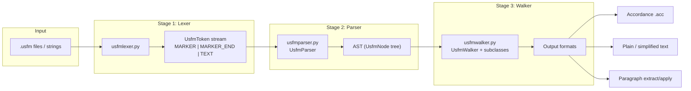
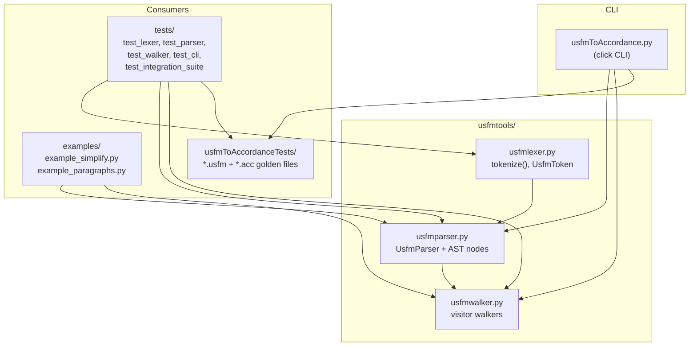
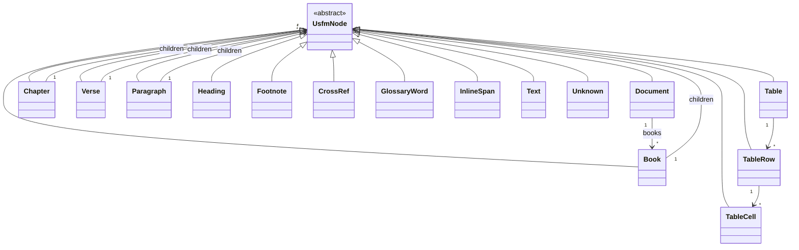
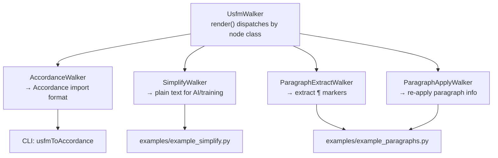

# USFM Parser Tools — Architecture

The toolkit is a small Python compiler for USFM (Unified Standard Format Markers) following a three-stage design: **Lexer → Parser → Walker**.

## High-level pipeline



## Package structure and entry points



## AST hierarchy

The parser builds a tree rooted at `Document`:



## Walker pattern (visitor dispatch)

Walkers traverse the AST via `render()` → `visit_<nodetype>()`:



## Data flow (one conversion)

```mermaid
sequenceDiagram
    participant User
    participant CLI as usfmToAccordance
    participant Lex as tokenize()
    participant Par as UsfmParser
    participant AST as Document tree
    participant W as AccordanceWalker

    User->>CLI: .usfm file(s) + flags
    CLI->>Par: load() / loads()
    Par->>Lex: tokenize(usfm_text)
    Lex-->>Par: List[UsfmToken]
    Par-->>CLI: Document
    CLI->>W: render(document)
    W-->>CLI: formatted string
    CLI-->>User: stdout (.acc)
```

## Repo layout

| Path | Role |
|------|------|
| `usfmtools/usfmlexer.py` | Tokenization (`\markers`, text, line numbers) |
| `usfmtools/usfmparser.py` | AST + `UsfmParser` |
| `usfmtools/usfmwalker.py` | Output walkers (Accordance, simplify, paragraphs) |
| `usfmtools/usfmToAccordance.py` | CLI entry (`python -m usfmtools.usfmToAccordance`) |
| `tests/` | Unit + integration pytest |
| `usfmToAccordanceTests/` | Golden USFM ↔ `.acc` pairs |
| `examples/` | Programmatic usage demos |

## Design takeaway

Lexer, parser, and walker are separate so you can add markers or output formats without touching the other stages. The CLI is a thin layer over `UsfmParser` + `AccordanceWalker`; tests and golden files validate the full pipeline end to end.

For more detail on supported markers and usage, see [README.md](../README.md).
